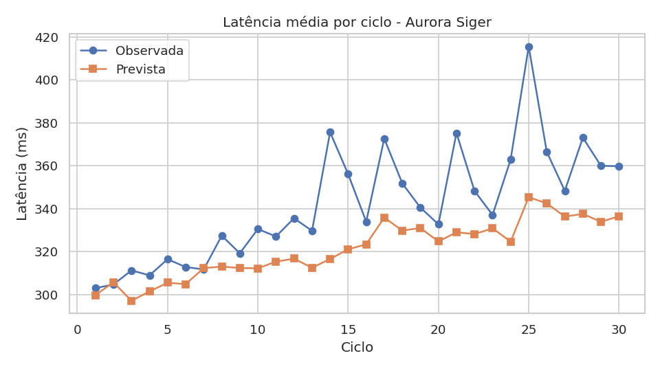
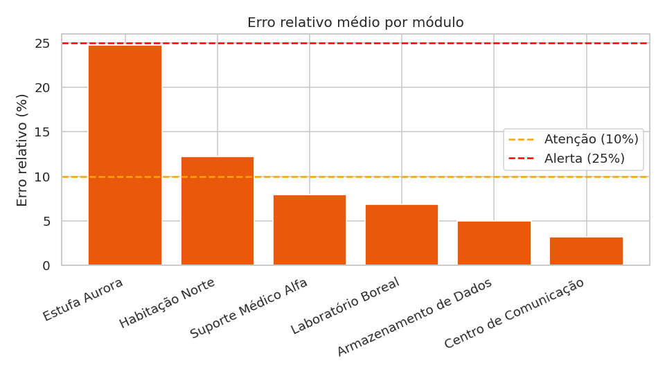
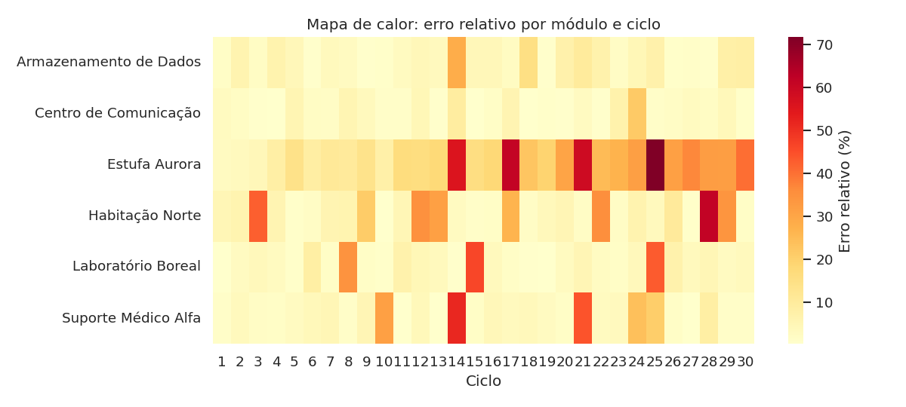
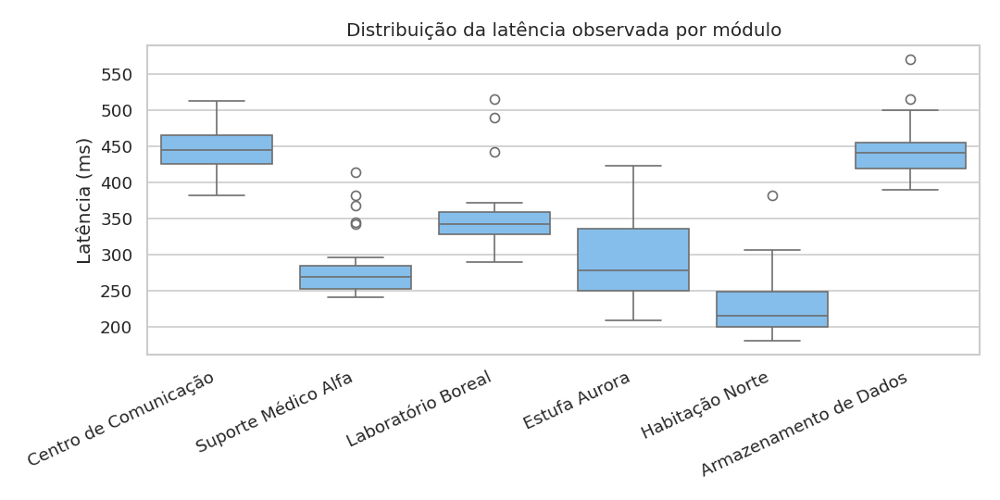

# Relatório Técnico - SCIC: Sistema de Comunicação Interplanetária da Colônia

**Projeto:** Atividade Integradora - Aurora Siger
**Instituição:** FIAP - Ciência da Computação
**Ano:** 2026

**Equipe:**

| Integrante | RM |
| --- | --- |
| Lucas Ribeiro Gesini | RM569383 |
| Calebe Gonçalves Garcia de Souza | RM568743 |
| Filipe Souza Nascimento | RM573758 |
| Rafael De Freitas Silva | RM570089 |
| Paulo Henrique Gonçalves Bueno | RM570456 |

**Repositório:** https://github.com/lucasgesini45-coder/SCIC-Sistema-de-Comunica-o-Interplanet-ria-da-Col-nia

---

## Sumário

1. Introdução e contexto da solução
2. Descrição dos dados
3. Arquitetura do sistema
4. Análise numérica e erros
5. Modelo simples de previsão
6. Avaliação de performance (MAE, MSE, RMSE e R²)
7. Priorização de alertas com heap
8. Busca de registros com trie
9. Dispositivos, bases numéricas e eletricidade básica
10. Gerenciamento inteligente da comunicação
11. Reflexão social, cultural e sustentável
12. Limitações
13. Possíveis melhorias
14. Conclusão

---

## 1. Introdução e contexto da solução

A **Aurora Siger** é uma colônia interplanetária fictícia composta por módulos com funções essenciais: comunicação, habitação, agricultura, laboratório, suporte médico e armazenamento de dados. A comunicação entre esses módulos, e entre a colônia e a Terra, é crítica: latências acima do esperado podem atrasar decisões, comprometer a segurança dos moradores e desperdiçar energia.

O **SCIC** é um protótipo em Python, executado no terminal, que:

- organiza dados operacionais e de comunicação dos módulos da colônia (arquivo CSV, lido com Pandas);
- compara a latência prevista com a latência observada e calcula erro absoluto e erro relativo;
- classifica cada leitura como Ativo, Atenção ou Alerta conforme o erro relativo;
- treina um modelo de regressão linear para estimar a latência observada, com divisão em treino, validação e teste;
- avalia o modelo com MAE, MSE, RMSE e R², e compara modelos com AIC, BIC, Grid Search e Random Search;
- simula a recuperação da latência após um pico com o método de Euler;
- prioriza alertas críticos com uma estrutura de heap implementada manualmente;
- permite busca por prefixo com uma trie implementada manualmente;
- relaciona o protótipo com dispositivos de entrada e saída, bases numéricas e eletricidade básica;
- gera gráficos e uma análise final de apoio à decisão.

O objetivo não é construir um sistema real de telemetria, e sim demonstrar, de forma coerente com a missão, como os conteúdos estudados (análise de dados, métricas de erro, estruturas de dados, bases numéricas e eletricidade) se combinam para apoiar decisões sobre a comunicação da colônia.

### 1.1 Escopo e restrições

Conforme a atividade, o protótipo usa somente conteúdos estudados até esta fase. Sensores, APIs, hardware, dashboards web e sistemas reais de telemetria são **simulados ou tratados de forma conceitual**.

**Dependências** (arquivo `requirements.txt`): `pandas`, `numpy`, `matplotlib` e `seaborn`. A regressão linear, as métricas, a heap e a trie foram implementadas com NumPy e Python puro, **sem scikit-learn**, para que a equipe demonstre o funcionamento de cada algoritmo. É necessário Python 3.10 ou superior (o código usa `match/case`). Instalação: `pip install -r requirements.txt`. Execução: `python codigo_fonte.py`.

---

## 2. Descrição dos dados

Os dados ficam em `dados_aurora_siger.csv`, uma base **simulada**, gerada pelo próprio sistema (menu "Dados e consultas > Gerar dados simulados", com semente fixa 42). Ela contém **180 registros**: 6 módulos × 30 ciclos de operação, sem valores ausentes. Como a semente é fixa, qualquer integrante que gerar 30 ciclos obtém exatamente os mesmos dados. O sistema também permite cadastrar módulos manualmente, com validação de entrada.

### 2.1 Campos

| Campo | Descrição | Uso no sistema |
| --- | --- | --- |
| `ciclo` | Ciclo de operação (1 a 30) | Ordem temporal, entrada do modelo |
| `nome` | Nome do módulo | Consulta, agrupamentos, trie |
| `tipo` | Categoria do módulo | Entrada do modelo, trie |
| `codigo_sensor` | Identificador do sensor (ex.: SEN-A1F) | Trie, conversão de bases |
| `latencia_observada` | Latência medida, em ms | Variável alvo do modelo |
| `latencia_prevista` | Latência esperada, em ms | Base do erro, linha de referência |
| `erro_absoluto` | \|observada - prevista\|, em ms | Indicador |
| `erro_relativo_pct` | erro absoluto / prevista × 100 | Classificação e alertas |
| `tensao` | Tensão, em V | Cálculo de potência |
| `corrente` | Corrente, em A | Cálculo de potência |
| `potencia` | Potência, em W (V × I) | Entrada do modelo |
| `status` | Ativo, Atenção, Alerta, Manutenção ou Inativo | Fila de alertas |
| `prioridade` | Prioridade do módulo, de 1 (baixa) a 5 (alta) | Critério do heap |
| `persistencia` | Ciclos consecutivos fora do limite | Critério do heap, redundância |
| `mensagem_alerta` | Mensagem resumida | Busca com trie |

### 2.2 Módulos

| Módulo | Tipo | Sensor | Prioridade |
| --- | --- | --- | --- |
| Centro de Comunicação | Comunicação | SEN-A1F | 5 |
| Suporte Médico Alfa | Suporte médico | SEN-B2C | 5 |
| Laboratório Boreal | Laboratório | SEN-C3D | 3 |
| Estufa Aurora | Agricultura | SEN-D4E | 4 |
| Habitação Norte | Habitação | SEN-E5F | 4 |
| Armazenamento de Dados | Armazenamento de dados | SEN-F60 | 3 |

### 2.3 Como os dados foram simulados

Para cada módulo e ciclo, a tensão e a corrente variam aleatoriamente em torno de valores nominais, e a potência é V × I. A latência prevista é uma fórmula simples (latência base do módulo + fator × potência + 1,5 × ciclo). A latência observada é a prevista com ruído aleatório, picos ocasionais (cerca de 12% das leituras) e, **de propósito, uma piora gradual no módulo Estufa Aurora**, para que o sistema tenha uma degradação real a detectar (manutenção preditiva). Em uma pequena fração das leituras o status é sobrescrito para Manutenção ou Inativo.

### 2.4 Resumo estatístico (180 registros)

| Variável | Mínimo | Média | Máximo |
| --- | --- | --- | --- |
| Latência observada (ms) | 180,95 | 341,60 | 570,49 |
| Latência prevista (ms) | 184,98 | 321,18 | 490,31 |
| Erro absoluto (ms) | 0,64 | 27,78 | 176,44 |
| Erro relativo (%) | 0,24 | 9,98 | 71,70 |
| Tensão (V) | 11,17 | 26,75 | 52,65 |
| Corrente (A) | 1,04 | 2,70 | 4,70 |
| Potência (W) | 32,52 | 66,44 | 129,69 |

**Distribuição de status:**

| Status | Registros | Percentual |
| --- | --- | --- |
| Ativo | 128 | 71,1% |
| Alerta | 24 | 13,3% |
| Atenção | 19 | 10,6% |
| Manutenção | 7 | 3,9% |
| Inativo | 2 | 1,1% |

**Limitação importante:** por ser uma base simulada, os resultados demonstram a metodologia e não permitem concluir sobre uma colônia real.

---

## 3. Arquitetura do sistema

O sistema é uma aplicação de terminal com menu principal e submenus. A lógica é separada em pacotes, cada um com uma responsabilidade.

```
SCIC/
├── codigo_fonte.py              # menu principal
├── dados_aurora_siger.csv       # base simulada (180 registros)
├── requirements.txt
├── README.md
├── modulos/
│   ├── inserir_dados.py         # constantes, leitura validada, salvar/carregar CSV
│   └── dados.py                 # visualizar e consultar módulos
├── simulacao/
│   └── simulacao.py             # geração de dados simulados
├── calculos/
│   ├── indicadores.py           # indicadores e erros
│   ├── regressao.py             # modelo, métricas, AIC/BIC, Grid/Random Search
│   ├── ponto_flutuante.py       # precisão numérica
│   ├── simulacao_euler.py       # método de Euler
│   ├── graficos.py              # Matplotlib e Seaborn
│   └── sistemas.py              # E/S, bases numéricas, potência, gerenciamento inteligente
├── alertas/
│   └── alertas.py               # heap (fila de prioridade)
├── busca/
│   └── busca.py                 # trie
├── relatorio/
│   └── analise_final.py         # resumo final
├── menus/                       # submenus do terminal
└── graficos_ou_imagens/         # gráficos gerados (PNG)
```

**Menu principal:**

| Opção | Função |
| --- | --- |
| 1 | Dados e consultas (visualizar, consultar módulo, cadastrar, gerar dados simulados) |
| 2 | Análises e previsão (indicadores, modelo, avaliação, Grid/Random Search, precisão numérica, Euler, gráficos) |
| 3 | Alertas e buscas (heap e trie) |
| 4 | Sistemas e eletricidade (E/S, bases, potência, gerenciamento inteligente) |
| 5 | Análise final (gera o resumo da colônia) |
| 6 | Glossário |
| 0 | Sair |

**Decisões técnicas:**

- **Organização em pacotes** por responsabilidade, o que facilita manutenção e divisão do trabalho.
- **Constantes centralizadas** em `inserir_dados.py` (colunas, tipos, status e os limites de 10% e 25%), de modo que mudar um limite altera todo o sistema.
- **Validação de entradas** (`ler_texto`, `ler_float`, `ler_inteiro`): o usuário não consegue cadastrar campos vazios, valores negativos ou latência prevista igual a zero, o que evitaria a divisão por zero no erro relativo.
- **Verificação do CSV** ao carregar: arquivo ausente, colunas faltando ou poucos registros geram mensagens orientando o usuário.
- **Tratamento de exceções** (`try/except`) nos menus de análise, para que um erro não derrube o programa.
- **Backup automático** do CSV antes de substituí-lo por novos dados simulados.
- **Heap e trie implementadas à mão**, para demonstrar as estruturas estudadas, e não apenas usar bibliotecas prontas.
- **Comentários no código** explicando as etapas e mensagens claras ao usuário.

---

## 4. Análise numérica e erros

### 4.1 Erro absoluto e erro relativo

Para cada registro, o sistema compara a latência prevista com a observada:

```
Erro absoluto = |latencia_observada - latencia_prevista|
Erro relativo (%) = (Erro absoluto / latencia_prevista) x 100
```

O **erro absoluto** mostra a diferença na unidade da latência (ms). O **erro relativo** coloca módulos com escalas diferentes na mesma régua: 20 ms pesam muito em 100 ms (20%) e pouco em 5000 ms (0,4%).

### 4.2 Classificação

| Erro relativo | Situação | Interpretação |
| --- | --- | --- |
| Até 10% | Ativo | Aceitável, variação normal do enlace |
| Acima de 10% até 25% | Atenção | Preocupante, acompanhar |
| Acima de 25% | Alerta | Crítico, exige ação |

Esses limites são um critério operacional adotado pela equipe para o protótipo. Em uma colônia real, dependeriam do tipo do módulo (um módulo médico tolera menos erro que o armazenamento de dados em segundo plano).

### 4.3 Resultados dos indicadores (execução do menu 2 > 1)

| Indicador | Valor |
| --- | --- |
| Registros / módulos / ciclos | 180 / 6 / 30 |
| Latência observada (média, mín., máx.) | 341,60 / 180,95 / 570,49 ms |
| Latência prevista (média) | 321,18 ms |
| **Erro absoluto médio** | **27,78 ms** (máximo 176,44 ms) |
| **Erro relativo médio** | **9,98%** (máximo 71,70%) |
| Maior erro relativo | Estufa Aurora (SEN-D4E), ciclo 25 |
| Registros com erro relativo acima de 10% | 45 (25,0%) |
| Registros com erro relativo acima de 25% | 26 (14,4%) |

**Por módulo (ordenado pelo erro relativo médio):**

| Módulo | Erro relativo médio (%) | Erro relativo máximo (%) | Latência observada média (ms) |
| --- | --- | --- | --- |
| Estufa Aurora | 24,79 | 71,70 | 295,87 |
| Habitação Norte | 12,19 | 61,52 | 229,58 |
| Suporte Médico Alfa | 7,92 | 51,43 | 281,83 |
| Laboratório Boreal | 6,82 | 46,20 | 352,92 |
| Armazenamento de Dados | 5,00 | 28,38 | 443,40 |
| Centro de Comunicação | 3,16 | 21,54 | 446,01 |

**Leitura dos resultados:** o erro relativo médio geral (9,98%) fica no limite da faixa aceitável, mas esconde uma situação desigual. O Centro de Comunicação erra em média 3,16%, enquanto a Estufa Aurora erra 24,79%, praticamente no limite de alerta. Essa diferença só aparece ao olhar módulo a módulo. O erro absoluto médio (27,78 ms) também é bem menor que o máximo (176,44 ms), o que indica que a maioria das leituras é próxima do previsto e poucas têm desvios grandes.

### 4.4 Ponto flutuante e precisão numérica (menu 2 > 5)

Os números decimais são armazenados em binário e muitos valores só podem ser aproximados. O sistema demonstra isso com quatro experimentos:

| Experimento | Resultado |
| --- | --- |
| 0,1 + 0,2 | 0,30000000000000004; `0.1 + 0.2 == 0.3` é `False`; erro absoluto 5,55e-17; `math.isclose` retorna `True` |
| Somar 0,1 mil vezes (esperado 100) | 99,9999999999986; erro absoluto 1,41e-12 |
| 0,1 em float64 | 0,10000000000000000555 |
| 0,1 em float32 | 0,10000000149011611938 |

O erro acumulado ao somar mil vezes mostra que pequenos erros se somam, e a diferença entre float32 e float64 mostra que menos bits significam mais aproximação.

**Arredondamento nos dados da colônia:** no primeiro registro (Centro de Comunicação, ciclo 1), a latência observada é 422,52 ms e a prevista 410,2 ms. O erro absoluto calculado é 12,319999999999993 ms (e não exatamente 12,32) e o erro relativo sem arredondar é 3,003412969283275%. Arredondado em 2 casas, como no CSV, vale 3,0%. A diferença causada pelo arredondamento é de 3,41e-03 ponto percentual, muito menor que os limites de decisão (10% e 25%), portanto **não altera nenhum status**.

**Consequências práticas no SCIC:** comparações entre floats devem usar tolerância (`math.isclose`) ou faixas, como nos limites de classificação, e nunca igualdade exata; os valores exibidos são arredondados; e a divisão por zero no erro relativo é evitada validando que a latência prevista seja maior que zero (mínimo de 0,001 no cadastro).

### 4.5 Quando um erro é aceitável ou preocupante?

Um erro é **aceitável** quando fica dentro da variação esperada do enlace e não altera decisões (até 10%). É **preocupante** quando é grande (acima de 25%), quando se repete em ciclos seguidos no mesmo módulo, ou quando ocorre em módulo essencial. Os dados mostram os dois casos: um único pico, como o de 61,52% da Habitação Norte no ciclo 28, pode ser ruído, enquanto a Estufa Aurora ficou 20 ciclos seguidos fora do limite, o que indica degradação real do enlace. Erros de ponto flutuante (da ordem de 1e-16) são desprezíveis frente ao desvio real do enlace.

### 4.6 Simulação da recuperação da latência com o método de Euler (menu 2 > 6)

Depois de um pico, a latência tende a voltar ao valor normal. Isso foi modelado pela equação diferencial:

```
dL/dt = -a x (L - L_normal)
```

em que `L` é a latência, `L_normal` é a média observada do módulo e `a = 0,5` é a rapidez da recuperação. O método de Euler resolve a equação em passos de tamanho `h`:

```
L_novo = L_atual + h x (-a x (L_atual - L_normal))
```

Como essa equação tem solução exata, `L(t) = L_normal + (L0 - L_normal) x e^(-a t)`, é possível medir o erro do Euler.

**Exemplo executado para a Habitação Norte** (latência normal 229,6 ms, pico inicial 381,8 ms, passo h = 0,5, 10 ciclos):

| Tempo | Euler (ms) | Exato (ms) | Erro absoluto | Erro relativo |
| --- | --- | --- | --- | --- |
| 0,0 | 381,75 | 381,75 | 0,000 | 0,000% |
| 1,0 | 315,17 | 321,87 | 6,700 | 2,082% |
| 2,0 | 277,72 | 285,56 | 7,833 | 2,743% |
| 3,0 | 256,66 | 263,53 | 6,871 | 2,607% |
| 5,0 | 238,15 | 242,07 | 3,922 | 1,620% |
| 10,0 | 230,06 | 230,60 | 0,543 | 0,235% |

**Efeito do tamanho do passo no erro final (t = 10):**

| Passo h | Nº de passos | Erro absoluto (ms) |
| --- | --- | --- |
| 2,0 | 5 | 1,02534 |
| 1,0 | 10 | 0,87673 |
| 0,5 | 20 | 0,54277 |
| 0,1 | 100 | 0,12439 |
| 0,01 | 1000 | 0,01278 |

**Interpretação:** o Euler é uma aproximação, e quanto menor o passo, menor o erro, porque o erro de cada passo diminui. O custo é fazer mais contas (de 5 para 1000 passos). O maior erro ocorre no início, quando a curva é mais inclinada, e o erro cai conforme a latência se estabiliza. A simulação indica que, com `a = 0,5`, o enlace volta praticamente ao normal em cerca de 10 ciclos.

---

## 5. Modelo simples de previsão

### 5.1 Problema

Estimar a **latência observada** de um módulo a partir de características conhecidas antes da medição. É um problema de **regressão**.

### 5.2 Modelo

Foi usada **regressão linear** pelo método dos mínimos quadrados (equação normal resolvida com `numpy.linalg.solve`), com suporte opcional à regularização Ridge (parâmetro λ).

| Item | Definição |
| --- | --- |
| Variáveis de entrada | Tipo do módulo (uma coluna 0/1 por tipo), potência (W) e ciclo |
| Variável de saída | `latencia_observada` (ms) |
| Divisão dos dados | 60% treino (108), 20% validação (36), 20% teste (36) |
| Semente | 42 (divisão sempre igual) |

**Papel de cada conjunto:** o **treino** ajusta o modelo; a **validação** serve para escolher entre modelos candidatos (Grid e Random Search); o **teste** fica guardado até o fim, para dar uma nota final sem "viciar" a escolha.

### 5.3 O que o modelo aprendeu (menu 2 > 2)

| Parâmetro | Valor |
| --- | --- |
| Latência base de Agricultura | 154,1 ms |
| Latência base de Armazenamento de dados | 244,3 ms |
| Latência base de Comunicação | 167,3 ms |
| Latência base de Habitação | 87,7 ms |
| Latência base de Laboratório | 155,8 ms |
| Latência base de Suporte médico | 116,6 ms |
| Efeito da potência | +2,244 ms por W |
| Efeito do ciclo | +2,458 ms por ciclo |

Ou seja, módulos que consomem mais energia tendem a ter latência maior, e a latência cresce ao longo dos ciclos. A regressão linear foi escolhida por ser simples e **interpretável**: cada coeficiente tem um significado que a equipe consegue explicar.

### 5.4 Exemplos de previsão no conjunto de teste

| Ciclo | Sensor | Observada (ms) | Prevista (ms) | Erro abs. (ms) | Erro rel. |
| --- | --- | --- | --- | --- | --- |
| 28 | SEN-A1F | 439,6 | 455,3 | 15,6 | 3,4% |
| 10 | SEN-C3D | 340,8 | 356,9 | 16,1 | 4,5% |
| 2 | SEN-B2C | 242,7 | 260,6 | 17,9 | 6,9% |
| 23 | SEN-D4E | 316,2 | 310,8 | 5,4 | 1,8% |
| 30 | SEN-E5F | 230,4 | 250,9 | 20,5 | 8,2% |
| 26 | SEN-B2C | 296,1 | 329,7 | 33,6 | 10,2% |

O sistema também permite prever a latência de um novo cenário digitado pelo usuário (tipo, potência e ciclo).

---

## 6. Avaliação de performance

### 6.1 Métricas

Sendo `y` o valor real, `ŷ` o previsto e `n` o número de registros:

| Métrica | Fórmula | Interpretação |
| --- | --- | --- |
| MAE | média de \|y - ŷ\| | Erro médio, em ms |
| MSE | média de (y - ŷ)² | Penaliza erros grandes (unidade ms²) |
| RMSE | raiz do MSE | Penaliza erros grandes, em ms |
| R² | 1 - SQ_resíduos / SQ_total | Parte da variação explicada pelo modelo |

### 6.2 Resultados no conjunto de teste (menu 2 > 3)

O modelo é comparado com duas referências: a **latência prevista que já vem no CSV** e a previsão **ingênua** que sempre responde a média do treino.

| Métrica | Modelo de regressão | Prevista do CSV | Só a média |
| --- | --- | --- | --- |
| MAE (ms) | **29,860** | 31,490 | 73,551 |
| MSE (ms²) | **1611,002** | 2941,861 | 7128,189 |
| RMSE (ms) | **40,137** | 54,239 | 84,429 |
| R² | **0,742** | 0,528 | -0,144 |

**Desempenho nos três conjuntos (modelo escolhido):**

| Conjunto | MAE (ms) | RMSE (ms) | R² |
| --- | --- | --- | --- |
| Treino (108) | 24,330 | 34,874 | 0,864 |
| Validação (36) | 23,477 | 33,619 | 0,876 |
| Teste (36) | 29,860 | 40,137 | 0,742 |

### 6.3 Interpretação

- **O modelo supera as duas referências**, mas por margens diferentes. Contra a média, o ganho é enorme (R² de -0,144 para 0,742; um R² negativo significa que prever sempre a média do treino é pior do que prever a média do próprio teste, ou seja, essa referência não explica nada da variação). Contra a previsão que já vem no CSV, o ganho é real mas moderado: o MAE cai de 31,49 para 29,86 ms (cerca de 5%), enquanto o RMSE cai de 54,24 para 40,14 ms (cerca de 26%) e o R² sobe de 0,528 para 0,742. Isso sugere que o modelo reduz principalmente os erros grandes.
- **Um único número não basta.** O MAE sozinho (melhora de 5%) subestimaria o ganho do modelo, e o R² sozinho não diz o tamanho do erro em milissegundos.
- **RMSE maior que MAE.** O RMSE (40,1) é cerca de 1,34 vez o MAE (29,9). Isso indica que alguns registros têm erros bem acima da média. Na prática, 4 dos 36 registros de teste tiveram erro acima de 50 ms, e o maior (120,4 ms) foi o pico da Estufa Aurora no ciclo 25 (observado 422,5 ms contra 302,1 ms previstos), justamente o maior erro relativo da base. A mediana do erro no teste é de 20,8 ms, menor que o MAE, o que confirma que poucos erros grandes puxam a média para cima.
- **R² moderado (0,742).** O modelo explica 74,2% da variação da latência. Sobra variação não explicada, principalmente os picos pontuais que o modelo, por ser linear e sem informação sobre eventos, não consegue antecipar.
- **Teste pior que validação.** O R² de teste (0,742) é menor que o de validação (0,876) e treino (0,864). A causa mais provável é que o conjunto de teste contém o pico extremo da Estufa Aurora, e com apenas 36 registros um único valor extremo pesa bastante. Isso mostra a instabilidade de avaliar com poucos dados e reforça por que nenhuma métrica deve ser lida isoladamente.
- **R² alto não significa modelo perfeito.** Mesmo um R² de 0,87 não impede erros de mais de 100 ms em registros críticos.
- **Aceitabilidade do erro.** Um erro médio de 29,9 ms em latências de 180 a 570 ms equivale a algo em torno de 5% a 17% da latência (29,9 sobre 570 e sobre 180 ms), o que fica próximo da faixa de atenção e, portanto, deve ser interpretado com cuidado.

**Ressalva importante:** como os dados são simulados e a latência prevista nasce de uma fórmula parecida com a que o modelo aprende (base + efeito da potência + efeito do ciclo), os bons resultados são em parte esperados. Com dados reais, o desempenho poderia ser bem diferente.

### 6.4 Comparação de modelos com AIC e BIC (menu 2 > 3, treino)

O AIC e o BIC recompensam o ajuste e punem o excesso de parâmetros (o BIC pune mais). Menor é melhor.

| Modelo | AIC | BIC |
| --- | --- | --- |
| A: tipo + potência | 811,5 | 830,3 |
| B: tipo + potência + ciclo | **783,2** | **804,6** |

O modelo B (com o ciclo) venceu nos dois critérios, o que significa que a melhora do ajuste compensa o parâmetro adicional.

### 6.5 Grid Search e Random Search (menu 2 > 4)

Foram buscados dois hiperparâmetros: usar ou não o ciclo, e a força de regularização λ ∈ {0; 0,1; 1; 10; 100; 1000}. A nota de cada candidato é o RMSE na **validação**.

**Grid Search (todas as 12 combinações):**

| Usa ciclo | λ = 0 | 0,1 | 1 | 10 | 100 | 1000 |
| --- | --- | --- | --- | --- | --- | --- |
| Sim | **33,619** | 35,078 | 39,442 | 43,888 | 53,936 | 57,887 |
| Não | 37,045 | 37,330 | 40,843 | 47,965 | 65,128 | 71,060 |

Melhor da grade: com ciclo e λ = 0 (RMSE de validação 33,619).

**Random Search (5 combinações sorteadas):** testou (sem ciclo, λ = 0), (com ciclo, λ = 100), (sem ciclo, λ = 10), (com ciclo, λ = 0) e (com ciclo, λ = 1000). O melhor do sorteio foi o mesmo da grade: com ciclo e λ = 0 (RMSE 33,619).

**Modelo escolhido avaliado uma única vez no teste:** MAE 29,860, MSE 1611,002, RMSE 40,137, R² 0,742.

**Interpretação:** a regularização **piorou** o resultado conforme λ cresceu, e o melhor λ foi zero, ou seja, a regressão comum. Isso é coerente com um problema de poucas variáveis e dados bem comportados, em que o risco de sobreajuste é pequeno. A Random Search achou o mesmo campeão testando menos da metade das combinações, mas isso foi em parte sorte: com uma grade pequena ela pode perder o melhor, e a vantagem só é relevante quando a grade é enorme. A diferença entre as notas de validação (33,6) e teste (40,1) reforça o cuidado com a pequena quantidade de dados.

### 6.6 Gráficos (menu 2 > 7)

O sistema gera quatro gráficos em `graficos_ou_imagens/` (Matplotlib e Seaborn):

| Arquivo | Conteúdo |
| --- | --- |
| `latencia_por_ciclo.png` | Latência média observada e prevista por ciclo |
| `erro_relativo_por_modulo.png` | Erro relativo médio por módulo, com as linhas de 10% e 25% |
| `mapa_calor_erro.png` | Mapa de calor do erro relativo por módulo e ciclo |
| `distribuicao_latencia.png` | Boxplot da latência observada por módulo |









**Leitura do mapa de calor:** a linha da Estufa Aurora é visivelmente mais escura que as demais e fica mais intensa nos ciclos finais, mostrando a degradação gradual. Os demais módulos têm, em geral, cores claras com manchas isoladas (por exemplo, ciclos 14 e 21, em que vários módulos têm pico ao mesmo tempo), o que indica picos pontuais e não degradação contínua. O mapa mostra **quando e onde** a comunicação ficou ruim.

---

## 7. Priorização de alertas com heap

### 7.1 Representação dos alertas

Cada registro com status **Alerta** ou **Atenção** vira um dicionário com módulo, código do sensor, prioridade, persistência, erro relativo e mensagem. Dos 180 registros, **43** entram na fila (24 Alerta e 19 Atenção). Registros em Manutenção ou Inativo não entram, pois a causa já é conhecida e não é um desvio de comunicação.

### 7.2 Critério de prioridade

A chave de cada alerta é uma tupla comparada em ordem:

```
chave = (-prioridade do módulo, -persistência, -erro relativo, ordem no arquivo)
```

Em ordem de importância: (1) maior **prioridade do módulo** (1 a 5); (2) maior **persistência**, isto é, mais ciclos seguidos fora do limite; (3) maior **erro relativo**; (4) a ordem no arquivo só desempata alertas totalmente iguais. Como a heap implementada é mínima, usam-se valores negativos: quanto maior a urgência, menor a chave.

### 7.3 Como a heap organiza os alertas

A heap é uma árvore binária completa guardada em uma lista, em que o filho da posição `i` fica em `2i+1` (esquerdo) e `2i+2` (direito). A regra é que o **pai é sempre mais urgente que os filhos**, então o alerta mais urgente fica na posição 0.

- **Inserção (heapify-up):** o novo alerta entra no fim da lista e sobe, trocando com o pai, enquanto for mais urgente que ele. Custo O(log n).
- **Remoção do topo (heapify-down):** o topo é retirado, o último elemento ocupa a raiz e desce, trocando com o filho mais urgente, até a regra ser restabelecida. Custo O(log n).

Para montar a heap com os 43 alertas foram feitas **70 trocas** de posição.

**Os três primeiros níveis da árvore obtida (execução real):**

```
nível 0: SEN-B2C
nível 1: SEN-B2C   SEN-B2C
nível 2: SEN-B2C   SEN-D4E   SEN-D4E   SEN-A1F
```

### 7.4 Como o sistema seleciona o alerta mais urgente

O mais urgente está sempre na raiz, e consultá-lo custa O(1). Para obter um ranking, retira-se o topo repetidamente. **Ranking dos 10 alertas mais urgentes (menu 3 > 1 > 1):**

| Pos. | Sensor | Módulo | Status | Prio. | Pers. | Erro (%) |
| --- | --- | --- | --- | --- | --- | --- |
| 1 | SEN-B2C | Suporte Médico Alfa | Atenção | 5 | 2 | 20,76 |
| 2 | SEN-B2C | Suporte Médico Alfa | Alerta | 5 | 1 | 44,16 |
| 3 | SEN-B2C | Suporte Médico Alfa | Alerta | 5 | 1 | 31,49 |
| 4 | SEN-B2C | Suporte Médico Alfa | Atenção | 5 | 1 | 23,92 |
| 5 | SEN-A1F | Centro de Comunicação | Atenção | 5 | 1 | 21,54 |
| 6 | SEN-D4E | Estufa Aurora | Alerta | 4 | 20 | 40,19 |
| 7 | SEN-D4E | Estufa Aurora | Alerta | 4 | 19 | 32,03 |
| 8 | SEN-D4E | Estufa Aurora | Alerta | 4 | 18 | 32,08 |
| 9 | SEN-D4E | Estufa Aurora | Alerta | 4 | 17 | 36,80 |
| 10 | SEN-D4E | Estufa Aurora | Alerta | 4 | 16 | 31,25 |

O alerta mais urgente é o do **Suporte Médico Alfa (SEN-B2C)**, e a recomendação do sistema é verificar esse dispositivo primeiro.

**Observação sobre o critério:** como a prioridade do módulo vem antes do status e da persistência, um alerta de nível Atenção em um módulo de prioridade 5 (posição 1) passa à frente de alertas de nível Alerta em um módulo de prioridade 4. Foi uma escolha deliberada: um desvio moderado em um módulo vital para a vida (suporte médico) é mais urgente que um desvio maior em um módulo menos crítico. Em compensação, a Estufa Aurora, com 20 ciclos seguidos de problema, aparece apenas a partir da 6ª posição. Esse é um ponto de discussão: o critério privilegia a criticidade do módulo e subvaloriza a persistência. A equipe humana deve considerar isso ao interpretar o ranking (ver seções 11 e 13).

### 7.5 Vantagem sobre uma lista simples

| Operação | Lista não ordenada | Lista ordenada | Heap |
| --- | --- | --- | --- |
| Inserir | O(1) | O(n) | O(log n) |
| Ver o mais urgente | O(n) | O(1) | O(1) |
| Remover o mais urgente | O(n) | O(1) ou O(n) | O(log n) |

Em uma lista simples, ou se percorre tudo a cada consulta ou se reordena a cada novo alerta. A heap mantém a ordem **parcial** necessária, sem pagar o custo de ordenar tudo.

**Medição no sistema (menu 3 > 1 > 3):** com 2000 alertas aleatórios, retirando todos do mais urgente ao menos urgente, a heap levou **7,9 ms** e a lista simples **78,9 ms**, ou seja, a lista foi cerca de **9,9 vezes mais lenta**. Os tempos variam conforme o computador, mas a diferença cresce com o número de alertas. Isso importa em uma colônia onde novos alertas chegam continuamente e a resposta ao mais crítico não pode esperar.

---

## 8. Busca de registros com trie

### 8.1 O que é a trie

A trie (árvore de prefixos) guarda palavras letra por letra. Cada nó representa uma letra e palavras com o mesmo começo compartilham o mesmo caminho. Por exemplo, "comunicação" e "comando" compartilham o caminho c → o → m.

### 8.2 O que é armazenado

O sistema constrói **três tries**:

| Índice | Conteúdo | Termos | Nós |
| --- | --- | --- | --- |
| Módulos e tipos | Nome completo, tipo e cada palavra deles | 21 | 159 |
| Códigos de sensores | Código completo (ex.: SEN-A1F) | 6 | 23 |
| Palavras-chave de alertas | Palavras da mensagem (3 letras ou mais) e o status | 17 | 106 |

Antes de inserir ou buscar, o texto é **normalizado**: passa para minúsculas e perde os acentos. Assim, "Comunicação", "comunicacao" e "COMUNICAÇÃO" seguem o mesmo caminho.

### 8.3 Como funciona a busca

1. Desce-se pela trie seguindo as letras do prefixo (custo proporcional ao tamanho do prefixo).
2. Se alguma letra não existir, não há resultados.
3. Se existir, coletam-se, em ordem alfabética, todas as palavras da subárvore abaixo daquele nó, junto com os registros do CSV ligados a elas.

**Exemplos executados (menu 3 > 2 > 1):**

| Onde buscar | Prefixo | Resultado |
| --- | --- | --- |
| Módulos e tipos | `com` | "Comunicação"; mostra os registros mais recentes do Centro de Comunicação (30 registros distintos) |
| Códigos de sensores | `SEN-A` | "SEN-A1F" (30 registros) |
| Palavras-chave de alertas | `lat` | "Latência" (43 registros: as mensagens "Latência acima do previsto" e "Latência crítica no enlace") |

O resultado de cada busca mostra os termos encontrados e uma tabela com os 10 registros mais recentes (ciclo, sensor, módulo, status, latência e mensagem). A busca "Em tudo" consulta as três tries de uma vez.

### 8.4 Por que a trie é adequada

A busca por prefixo na trie custa O(m), em que m é o tamanho do prefixo, **independentemente de quantos registros existam**. Em uma lista, seria preciso comparar o prefixo com cada termo, com custo O(n·m). A trie também apoia naturalmente o autocompletar, útil para um operador digitando um código ou comando sob pressão. Em uma colônia com milhares de sensores, isso acelera a localização de registros.

**Custo:** a trie usa mais memória que uma lista simples, uma troca aceitável para este caso.

---

## 9. Dispositivos, bases numéricas e eletricidade básica

### 9.1 Dispositivos de entrada e saída (menu 4 > 1)

| Tipo | Dispositivo | Função no SCIC |
| --- | --- | --- |
| Entrada | Teclado | Cadastro manual de módulos |
| Entrada | Arquivo CSV | Leituras dos sensores simulados |
| Entrada | Sensores e medidores (simulados) | Medem latência, tensão e corrente |
| Saída | Terminal | Menus, tabelas, ranking de alertas e buscas |
| Saída | Arquivo de texto | Resumo da análise final (`resumo_analise_final.txt`) |
| Saída | Imagens PNG | Gráficos salvos em `graficos_ou_imagens/` |
| Saída | Arquivo CSV | Armazenamento dos dados gerados |
| Interface (conceitual) | Rede / Wi-Fi | Envio das leituras dos módulos até a central |
| Interface (conceitual) | USB | Ligação de medidores e coleta local |
| Interface (conceitual) | Bluetooth | Sensores de curto alcance dentro de um módulo |

Nos dados atuais, há 6 sensores em 6 módulos, com 180 leituras. No protótipo os sensores são **simulados** pelo CSV; em um sistema real seriam leituras contínuas enviadas por rede.

### 9.2 Códigos de sensor e bases numéricas (menu 4 > 2)

O sistema converte números entre decimal, binário e hexadecimal por **divisões sucessivas** (os restos, lidos de trás para a frente, formam o número na nova base) e mostra a expansão posicional. Os códigos de sensor têm sufixo hexadecimal, que pode ser lido como identificador numérico.

**Exemplo com o sensor SEN-A1F (Centro de Comunicação):**

| Representação | Valor |
| --- | --- |
| Hexadecimal | A1F |
| Expansão posicional | 10×16² + 1×16¹ + 15×16⁰ |
| Decimal | 2591 |
| Binário | 1010 0001 1111 |

Verificação: 10×256 + 1×16 + 15 = 2560 + 16 + 15 = 2591. Cada dígito hexadecimal corresponde a exatamente 4 bits (A = 1010, 1 = 0001, F = 1111), o que torna o hexadecimal uma forma compacta de escrever identificadores de dispositivos.

**Segundo exemplo, com o decimal 171:** pelas divisões por 2, os restos lidos de baixo para cima dão 1010 1011 (binário), e pelas divisões por 16 (171 ÷ 16 = 10, resto 11) obtém-se AB (hexadecimal).

O sistema avisa quando o sufixo de um código tem letras fora de 0-9 e A-F, caso em que ele não pode ser lido como hexadecimal.

### 9.3 Eletricidade básica (menu 4 > 3)

A potência é calculada por **P = V × I**, e a lei de Ohm **V = R × I** permite obter a resistência **R = V / I**.

**Exemplo com um registro real (ciclo 1, Centro de Comunicação, SEN-A1F):** tensão de 28,34 V e corrente de 3,5 A resultam em P = 28,34 × 3,5 = **99,19 W**.

**Exemplo do cálculo manual executado no sistema:** com 12 V e 2,5 A, P = 12 × 2,5 = **30 W** (0,03 kW), a resistência é R = 12 / 2,5 = **4,8 ohms** e a energia em 1 hora de operação é 0,03 kWh.

**Potência média por módulo (dados do CSV):**

| Módulo | Tensão média (V) | Corrente média (A) | Potência média (W) |
| --- | --- | --- | --- |
| Centro de Comunicação | 28,11 | 3,83 | 107,67 |
| Armazenamento de Dados | 48,14 | 1,51 | 72,38 |
| Laboratório Boreal | 24,00 | 2,99 | 71,74 |
| Suporte Médico Alfa | 24,23 | 2,40 | 58,03 |
| Habitação Norte | 23,95 | 1,92 | 46,00 |
| Estufa Aurora | 12,05 | 3,56 | 42,85 |

O consumo médio somado dos módulos é de **0,399 kW**, e o maior consumidor é o Centro de Comunicação (107,7 W, cerca de 27% do total). Esse resultado é coerente: o módulo que mais transmite é o que mais consome.

**Relação com a comunicação e com o modelo:** a potência do transmissor influencia o alcance e a qualidade do enlace, mas também o consumo de energia da colônia. No modelo de previsão, cada watt adicional está associado a +2,244 ms de latência, ligando diretamente a eletricidade ao desempenho da comunicação.

---

## 10. Gerenciamento inteligente da comunicação

O SCIC se relaciona com sistemas inteligentes de gerenciamento da comunicação porque cada função sua corresponde, em escala reduzida, a um conceito desses sistemas. A análise abaixo parte dos resultados reais do protótipo (menu 4 > 4).

**1. Sensores e monitoramento contínuo.** Seis sensores acompanham seis módulos ao longo de 30 ciclos (180 leituras). Medir a cada ciclo permite comparar o previsto com o observado e perceber desvios cedo. Em uma colônia real, medidores inteligentes enviariam esses dados automaticamente.

**2. Detecção de anomalias.** O erro relativo funciona como detector simples de anomalias: **45 leituras (25,0%)** ficaram com erro acima de 10%, e o maior desvio foi o da Estufa Aurora (SEN-D4E) no ciclo 25, com 71,7%. O monitoramento contínuo tornaria essa checagem automática a cada ciclo.

**3. Automação de decisões.** A heap indicou o Suporte Médico Alfa (SEN-B2C) como o mais urgente. A automação **sugere** a ordem de atendimento, mas a equipe humana valida antes de agir. Em uma situação crítica, isso poupa tempo ao mostrar primeiro o que mais importa.

**4. Armazenamento de dados e enlaces redundantes.** A Estufa Aurora ficou **20 ciclos seguidos** fora do limite, e o sistema a apontou como candidata a **enlace redundante**: se o enlace principal está degradado de forma persistente, uma rota alternativa manteria a comunicação estável. O critério usado é de 3 ou mais ciclos seguidos fora do limite. Guardar o histórico em arquivo também permite recuperar os dados se um enlace cair.

**5. Manutenção preditiva.** O sistema ajusta uma reta ao erro relativo de cada módulo por ciclo. Se a inclinação supera 0,5 ponto percentual por ciclo, o erro está piorando. Resultado: a **Estufa Aurora tem erro subindo 1,40 ponto percentual por ciclo**, e nenhum outro módulo apresentou tendência clara de piora. Isso significa que a manutenção poderia ser programada **antes** de a falha se consolidar, reduzindo paradas. Esse resultado confirma a degradação que foi inserida de propósito na simulação, mostrando que o método é capaz de detectá-la.

**6. Redes inteligentes e microrredes.** A colônia opera como uma microrrede isolada, em que energia e comunicação são recursos limitados e interdependentes. O consumo médio somado é 0,399 kW e o Centro de Comunicação responde por cerca de 27% dele. Saber quem mais consome ajuda a dividir a energia e manter os módulos essenciais (comunicação e suporte médico) funcionando em caso de falta.

**Resumo:** os indicadores de latência, os alertas, as falhas persistentes e as prioridades do SCIC mostram, na prática, como a gestão inteligente da comunicação funcionaria na Aurora Siger: **medir, detectar, priorizar, redirecionar e manter**, sempre com validação humana.

### 10.1 Análise final gerada pelo sistema (menu 5)

O sistema reúne os principais resultados em um resumo exibido no terminal e salvo em `resumo_analise_final.txt`:

| Item | Resultado |
| --- | --- |
| Situação | Ativo 128 (71,1%), Atenção 19 (10,6%), Alerta 24 (13,3%), Manutenção 7 (3,9%), Inativo 2 (1,1%) |
| Latência observada | média 341,60 ms, mínimo 180,95 ms, máximo 570,49 ms |
| Erros | erro absoluto médio 27,78 ms; erro relativo médio 9,98%; maior erro relativo no SEN-D4E (71,70%); 45 registros acima de 10% |
| Eletricidade | potência média por leitura 0,066 kW; maior potência no SEN-A1F |
| Desempenho da previsão gravada na base | MAE 27,784; MSE 2147,309; RMSE 46,339; R² 0,749 |
| Alerta mais urgente | Suporte Médico Alfa (SEN-B2C) |
| Recomendação | Verificar primeiro o dispositivo SEN-B2C; decisões automatizadas devem ser validadas pela equipe humana |

Observação: as métricas do item "Desempenho da previsão gravada na base" usam **todos os 180 registros** (previsão do CSV contra a observada), enquanto a tabela da seção 6.2 usa apenas os 36 registros de teste. Por isso os números diferem (por exemplo, R² de 0,749 contra 0,528 da previsão do CSV no teste); não há contradição, e sim conjuntos de avaliação diferentes.

---

## 11. Reflexão social, cultural e sustentável

### 11.1 Uso eficiente da comunicação e sustentabilidade

Em uma colônia isolada, energia e capacidade de transmissão são limitadas. Identificar módulos com latência anômala evita retransmissões, consumo desnecessário e desperdício de recursos. O SCIC mostra o consumo de cada módulo (de 42,85 W na Estufa Aurora a 107,67 W no Centro de Comunicação) e relaciona potência com latência, apoiando o uso proporcional dos recursos, o que é, na prática, uma forma de sustentabilidade. Detectar cedo a degradação da Estufa Aurora também evita que uma falha total comprometa a produção de alimentos da colônia.

### 11.2 Conhecimentos tradicionais e respeito à natureza

Muitas culturas indígenas organizam a vida em torno do uso cuidadoso dos recursos, pensando em quem virá depois e em não retirar do ambiente mais do que ele pode repor. Esse princípio inspira um critério de projeto: **a colônia não deve operar no limite dos seus recursos**. No SCIC, isso aparece ao valorizar a manutenção preventiva e a redundância em vez de reagir apenas depois da falha (a Estufa Aurora foi apontada para manutenção enquanto o erro ainda subia), e ao considerar o impacto sobre a comunidade, e não só o desvio numérico, na prioridade dos alertas. A equipe reconhece que é uma inspiração conceitual: um projeto real deveria envolver a participação de representantes dessas comunidades, e não apenas citá-las.

### 11.3 Diversidade cultural e sistemas não excludentes

Sistemas de dados refletem as escolhas de quem os constrói. Uma colônia reúne pessoas de origens, línguas e costumes diferentes. Se os critérios de prioridade, as mensagens de alerta e as interfaces forem pensados por um único grupo, podem ignorar necessidades de outros. Por isso o projeto adota mensagens objetivas e em linguagem simples, oferece um **glossário** que explica cada informação do sistema (menu 6), e prevê que os pesos do critério de prioridade sejam revisados com a participação de diferentes grupos de moradores. A busca por prefixo ignora acentos e maiúsculas, o que evita excluir quem digita sem acentuação.

### 11.4 Transparência nas decisões baseadas em dados

O SCIC foi desenhado para ser **explicável**. O erro é calculado com fórmula simples, a classificação usa limites declarados, o critério de prioridade é uma sequência clara (prioridade do módulo, persistência, erro relativo) e o sistema tem uma opção que explica o critério e mostra como a heap organiza os alertas. Cada coeficiente do modelo tem significado direto. Qualquer morador ou técnico pode entender por que um alerta apareceu antes de outro. Por isso a equipe escolheu regressão linear em vez de modelos opacos. A transparência também inclui apontar limites do próprio sistema, como a observação da seção 7.4, em que o critério coloca um alerta de Atenção do módulo médico à frente de alertas persistentes de outro módulo.

### 11.5 Responsabilidade da equipe humana

O sistema **apoia** a decisão, não a substitui. A ordem da heap é uma sugestão baseada nos dados, e a análise final registra explicitamente que decisões automatizadas devem ser validadas pela equipe humana. Cabe a ela considerar contexto que os números não capturam (uma manutenção programada, uma emergência médica em curso). Um exemplo concreto: o ranking coloca a Estufa Aurora a partir da 6ª posição, embora tenha 20 ciclos seguidos de problema. Um operador que olhasse apenas o topo da lista poderia ignorar uma degradação persistente e grave. Por isso nenhuma ação crítica deve ser executada sem confirmação humana.

### 11.6 Linguagem e interpretações injustas

As mensagens do sistema descrevem **fatos técnicos** ("Latência acima do previsto", "Latência crítica no enlace", "Sem comunicação com o módulo"), sem culpar pessoas ou grupos. Os dados dizem respeito a módulos e sensores, não a indivíduos, e não devem ser usados para avaliar ou punir pessoas, e sim para melhorar o funcionamento dos sistemas.

---

## 12. Limitações

- **Base simulada e pequena** (180 registros, 30 ciclos, 6 módulos): as métricas não generalizam para uma colônia real.
- **Dados com estrutura conhecida:** a latência prevista nasce de uma fórmula parecida com a que o modelo aprende, o que favorece o resultado. Com dados reais, o desempenho poderia ser menor.
- **Conjunto de teste pequeno** (36 registros, com apenas 1 do tipo Armazenamento de dados): um único pico extremo, como o da Estufa Aurora no ciclo 25, reduz bastante o R² de teste (0,742 contra 0,876 na validação).
- **Modelo linear simples:** não captura picos pontuais nem relações não lineares, e usa só tipo, potência e ciclo.
- **Ganho moderado sobre a previsão do CSV:** o MAE melhora cerca de 5% (29,86 contra 31,49 ms); o ganho maior está no RMSE.
- **Limites de classificação (10% e 25%) são uma escolha da equipe**, sem validação com dados reais e iguais para todos os módulos.
- **Critério de prioridade da heap** dá peso máximo à prioridade do módulo e pouco à persistência, o que deixa a Estufa Aurora (20 ciclos de problema) abaixo de alertas pontuais do suporte médico.
- **A heap só considera os status Alerta e Atenção**; Manutenção e Inativo ficam fora da fila.
- **Contagem de registros na trie:** ao buscar `com`, o sistema informa 90 registros, mas são 30 distintos, pois o mesmo registro é indexado por vários termos que levam ao mesmo caminho (nome, tipo e palavra do nome). A lista exibida remove as repetições, mas a contagem entre parênteses não.
- **Sensores, redes e telemetria são apenas simulados**; não há dados em tempo real.
- **Interface apenas em terminal**, com gráficos salvos como imagens, sem painel interativo.
- **A Random Search** só achou o melhor modelo porque a grade é pequena; não é uma comparação definitiva entre os métodos.

---

## 13. Possíveis melhorias

- Ampliar a base de dados e usar **validação cruzada**, para métricas mais estáveis que as de um único conjunto de teste de 36 registros.
- Incluir novas variáveis no modelo (por exemplo, o status anterior, a persistência ou interações entre tipo e potência) e testar modelos não lineares.
- Definir **limites de erro por tipo de módulo**, mais rígidos para módulos vitais.
- **Rever o critério da heap**, combinando prioridade, persistência e erro em um escore com pesos, para que degradações persistentes subam no ranking sem ignorar a criticidade do módulo.
- Colocar na fila também os módulos em **Manutenção e Inativos** quando a duração for incomum.
- Corrigir a contagem de registros da trie para contar apenas registros distintos.
- Usar **dados reais ou séries temporais** para detectar tendências de degradação por módulo de forma mais robusta.
- Variar o parâmetro `a` da simulação de Euler por módulo e testar métodos de ordem superior.
- Persistir os dados em **banco de dados** e criar uma interface gráfica ou web com painel em tempo real.
- Registrar um **log das decisões** para auditoria e transparência.

---

## 14. Conclusão

O SCIC demonstra, em escala de protótipo, como dados operacionais de uma colônia podem ser organizados, analisados e usados para apoiar decisões. Com 180 leituras de 6 módulos, o sistema calculou um erro relativo médio de 9,98%, identificou que a média escondia um módulo problemático (Estufa Aurora, com 24,79% de erro médio, 20 ciclos seguidos fora do limite e erro crescendo 1,40 ponto percentual por ciclo) e o apontou para manutenção e enlace redundante. O modelo de regressão linear superou as referências, com R² de teste de 0,742 contra 0,528 da previsão do CSV e MAE de 29,9 ms, embora com ganho moderado em MAE, e a análise das métricas mostrou por que nenhum número deve ser lido isoladamente. A heap priorizou os 43 alertas e foi cerca de 10 vezes mais rápida que uma lista simples em um teste com 2000 alertas, e a trie permitiu buscas por prefixo em módulos, sensores e mensagens.

Os resultados também deixaram lições: um critério de prioridade tem consequências que precisam ser examinadas, avaliações com poucos dados são instáveis e dados simulados favorecem o modelo. A discussão sobre gerenciamento inteligente e sobre impacto social e sustentável mostra que a tecnologia só cumpre seu papel quando é transparente, supervisionada por pessoas e atenta às comunidades que serve. Por isso o SCIC sugere, mas a decisão final continua humana.

---


